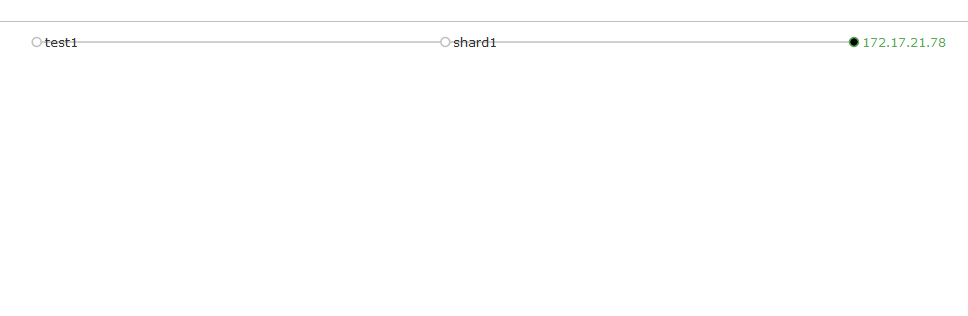
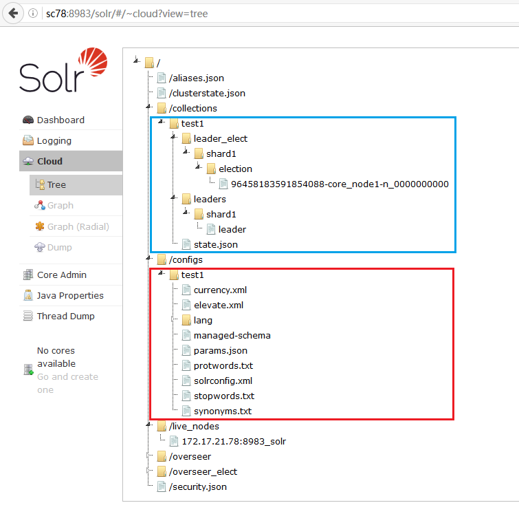
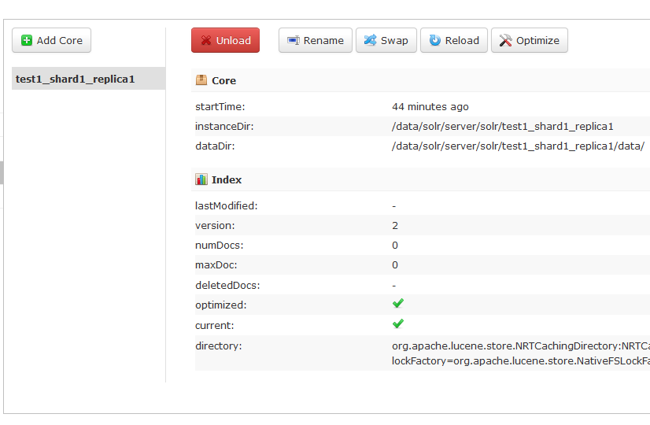

# 探索 Collection

很显然，我搭建 SolrCloud 的目地就是要在上面创建 collection。那么现在就来尝试一下吧

## 创建第一个 collection

如前所述，我已经在 sc78 上运行起了 SolrCloud。虽然这个 SolrCloud 仅由一个 node 组成，但其管理后台有 Cloud 菜单已充分证明 solr 的确运行在 cloud 模式下。现在就在这个 SolrCloud 上创建一个 collection 吧

使用命令行创建 collection，如下

```bash
[root@sc78 ~]# /data/solr/bin/solr create -c test1

Connecting to ZooKeeper at zk:2181/sc ...
Uploading /data/solr/server/solr/configsets/data_driven_schema_configs/conf for config test1 to ZooKeeper at zk:2181/sc

Creating new collection 'test1' using command:
http://localhost:8983/solr/admin/collections?action=CREATE&name=test1&numShards=1&replicationFactor=1&maxShardsPerNode=1&collection.configName=test1

{
  "responseHeader":{
    "status":0,
    "QTime":7683},
  "success":{"172.17.21.78:8983_solr":{
      "responseHeader":{
        "status":0,
        "QTime":5247},
      "core":"test1_shard1_replica1"}}}
```

说明

命令很简单，创建一个名称为 test1 的 collection。那么 solr 是如何执行这个命令的呢？根据 solr 的输出信息，我们看到 solr 实际执行了 2 个步骤

1. 将 /data/solr/server/solr/configsets/data_driven_schema_configs/conf 这个目录的内容上传到 zk 的 /sc 节点下
2. 新建 test1 这个 collection，实际是调用了 http 接口，其 url 是 http://localhost:8983/solr/admin/collections?action=CREATE&name=test1&numShards=1&replicationFactor=1&maxShardsPerNode=1&collection.configName=test1，请求的参数有 name， numShards， replicationFactor， maxShardsPerNode， configName，所谓见名知意，这几个参数的含义应该也不难理解

打开管理界面，进入 Cloud - Graph 页面，如下图



collection test1，由一个 shard，即 shard1 组成。shard1 有一个 replica，该 replica 在 172.17.21.78 上的 solr 实例中。

毫无疑问，这是一个最简单的 collection，实际上和单机模式下创建的 core 也没什么区别

## 探索 zk

接下来，探索一下步骤 1 里上传到 zk 的数据，进入 Cloud - Tree 页面，如下图



可以看到，在 /collections 下多出一个 test1 节点，同时在 /configs 节点下也多出了一个 test1 节点。回想创建 collection 的 url 里的 name 参数和 configName 参数，很显然，在步骤 1 里，是将 /data/solr/server/solr/configsets/data_driven_schema_configs/conf 目录下的所有文件都上传到了 zk 的 /configs/test1 节点下，然后在步骤 2 里，则是创建了 /collections/test1 节点并将 collection 的信息存储在这个节点。2 个节点使用相同的名字 test1，则说明 collection test1 使用 t/configs/test1 的配置

为了验证，看一下 /data/solr/server/solr/configsets/data_driven_schema_configs/conf 目录是否和 zk 里的信息一致

```bash
[root@sc78 ~]# ll /data/solr/server/solr/configsets/data_driven_schema_configs/conf
total 148
-rw-r--r-- 1 root root  4041 Jun 21 11:45 currency.xml
-rw-r--r-- 1 root root  1386 Jun 21 11:45 elevate.xml
drwxr-xr-x 2 root root  4096 Jun 21 11:45 lang
-rw-r--r-- 1 root root 54490 Jun 20 20:52 managed-schema
-rw-r--r-- 1 root root   329 Jun 21 11:45 params.json
-rw-r--r-- 1 root root   894 Jun 21 11:45 protwords.txt
-rw-r--r-- 1 root root 62113 Jun 21 11:45 solrconfig.xml
-rw-r--r-- 1 root root   795 Jun 21 11:45 stopwords.txt
-rw-r--r-- 1 root root  1148 Jun 21 11:45 synonyms.txt
```

结论很明显，没有必要再连接到 zk 上或者逐个查看文件内容是否一致了

## 探索 replica/core

collection 是由 至少一个 replica 组成的，而 replica 实际上就是 core。test1 这个 collection 的组成 shard1，而 shard1 在 172.17.21.78 上有一个 replica，那么就来验证一下

```bash

[root@sc78 ~]# ll /data/solr/server/solr/
total 20
drwxr-xr-x 5 root root 4096 Jun 21 11:45 configsets
-rw-r--r-- 1 root root 3114 Jun 21 11:45 README.txt
-rw-r--r-- 1 root root 2170 Jun 21 11:45 solr.xml
drwxr-xr-x 3 root root 4096 Aug 23 08:57 test1_shard1_replica1
-rw-r--r-- 1 root root  518 Jun 21 11:45 zoo.cfg
[root@sc78 ~]# ll /data/solr/server/solr/test1_shard1_replica1/
total 8
-rw-r--r-- 1 root root  185 Aug 23 08:57 core.properties
drwxr-xr-x 4 root root 4096 Aug 23 08:57 data
```

可以看到，的确有一个 core，其目录名为 test1_shard1_replica1，该目录下没有 conf 目录，显然这个 core 的配置是在 zk 上。

进入管理页面 CoreAdmin，也可以看到相同的信息

