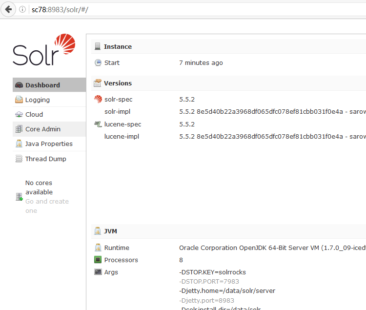

# 搭建 SolrCloud

## 以 cloud 模式启动

登录到 `sc78`，以 `cloud` 模式启动 `solr`

```bash
[root@sc78 ~]# /data/solr/bin/solr start -cloud -z zk:2181/sc
Waiting up to 30 seconds to see Solr running on port 8983 [/]
Started Solr server on port 8983 (pid=1871). Happy searching!
```

说明

* `-cloud` 表示以 `cloud` 模式启动 `solr`
* `-z zk:2181/sc` 表示 `ZooKeeper` 连接串为 `zk:2181/sc`，即以 `zk` 上的 `/sc` 作为 `SolrCloud` 配置的根节点

那么 `SolrCluoud` 启动成功了吗？执行 `status` 命令查看一下

```bash
[root@sc78 ~]# /data/solr/bin/solr status

Found 1 Solr nodes:

Solr process 1871 running on port 8983

ERROR: Failed to get system information from http://localhost:8983/solr due to: org.apache.http.client.ClientProtocolException: Expected JSON response from server but received: <html>
<head>
<meta http-equiv="Content-Type" content="text/html; charset=UTF-8"/>
<title>Error 404 Not Found</title>
</head>
<body><h2>HTTP ERROR 404</h2>
<p>Problem accessing /solr/admin/info/system. Reason:
<pre>    Not Found</pre></p><hr><i><small>Powered by Jetty://</small></i><hr/>

</body>
</html>

Typically, this indicates a problem with the Solr server; check the Solr server logs for more information.
```

看来 `Solr` 确实启动了，但是无法获取系统信息。经过检查，我们发现这是因为 `ZooKeeper` 上木有 `/sc` 这个节点的原因，我们连接到 `zk` 上运行 `zkCli.sh` 脚本，执行 `ls` 命令，如下

```bash
[zk: localhost:2181(CONNECTED) 0] ls /
[zookeeper]
```

可见，当前 `zk` 上仅有一个节点：`/zookeeper`。所以我们先在 `zk` 上创建 `/sc` 节点

```bash
[zk: localhost:2181(CONNECTED) 1] create /sc null
Created /sc
```

然后在 `sc78` 上重新启动 `SolrCloud`

停止 `solr` 进程

```bash
[root@sc78 ~]# /data/solr/bin/solr stop
Sending stop command to Solr running on port 8983 ... waiting 5 seconds to allow Jetty process 1871 to stop gracefully.
```

以 `cloud` 模式启动 `solr`

```bash
[root@sc78 ~]# /data/solr/bin/solr start -cloud -z zk:2181/sc
Waiting up to 30 seconds to see Solr running on port 8983 [/]
Started Solr server on port 8983 (pid=2240). Happy searching!
```

查看 `solr` 状态

```bash
[root@sc78 ~]# /data/solr/bin/solr status

Found 1 Solr nodes:

Solr process 2240 running on port 8983
{
  "solr_home":"/data/solr/server/solr",
  "version":"5.5.2 8e5d40b22a3968df065dfc078ef81cbb031f0e4a - sarowe - 2016-06-21 11:44:11",
  "startTime":"2016-08-22T06:45:44.443Z",
  "uptime":"0 days, 0 hours, 0 minutes, 11 seconds",
  "memory":"68.2 MB (%13.9) of 490.7 MB",
  "cloud":{
    "ZooKeeper":"zk:2181/sc",
    "liveNodes":"1",
    "collections":"0"}}
```

通过浏览器访问 `solr` 管理页面 `http://sc78:8983/solr/#/`



可以看到 `SolrCloud` 已经成功启动，点击左侧菜单栏的 `Cloud`-`Tree`


显示的实际上是 `ZooKeeper` 的 `/sc` 节点信息，其中 `/live_nodes` 节点下有一个名为 `172.17.21.78:8983_solr` 的节点，这表示 `SolrCloud` 集群当前有一个节点，该节点是运行在 `172.17.21.78` 上，监听端口为 `8983` 的 `solr` 实例。

我们连接到 `zk` 上看下是否如此

```bash
[zk: localhost:2181(CONNECTED) 0] ls /
[sc, zookeeper]
[zk: localhost:2181(CONNECTED) 1] ls /sc
[security.json, clusterstate.json, aliases.json, live_nodes, overseer, overseer_elect, collections]
[zk: localhost:2181(CONNECTED) 2] ls /sc/live_nodes
[172.17.21.78:8983_solr]
```
