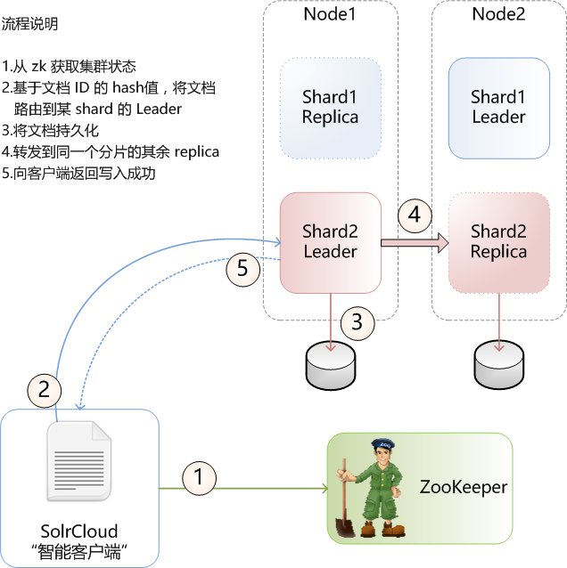
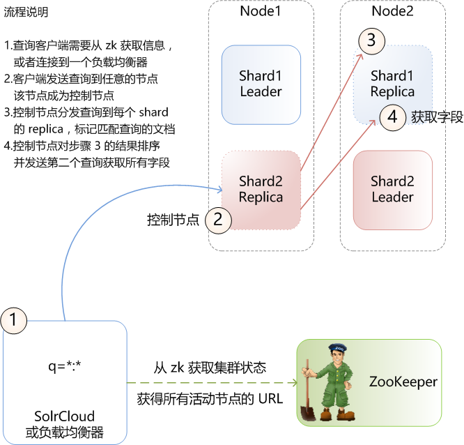

# 分布式索引和查询

## 分布式索引

> 注意：这里的智能客户端实际是 SolrCloud，最终用户不需要访问 zk 及计算文档 hash 来路由文档

当一个文档被发送到服务器上索引，系统首先判断服务器是否 Leader
* 服务器不是 Leader，文档会转发给 Leader
* 服务器是 Leader，SolrCloud 判断文档应该发送到哪个 shard，转发文档到该 shard 的 Leader 上索引

## 分布式查询

当一个 solr 节点接收到一个搜索请求，该请求被路由到 collection 的某个 shard 的某个 replica，这个 replica 会担当一个聚合器(控制节点)的角色

* 创建内部请求到每个 shard 的 随机选中的 replica 上
* 对响应进行整合
* 如果有必要，发送后续的内部请求，例如，请求额外的存储字段
* 构造最终的查询结果返回给客户端