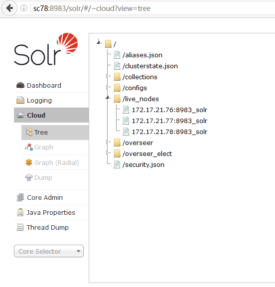
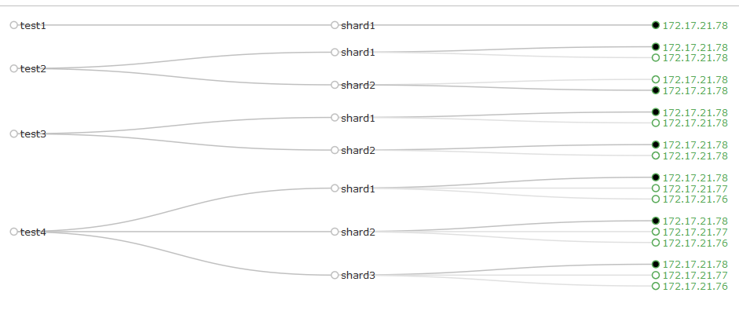
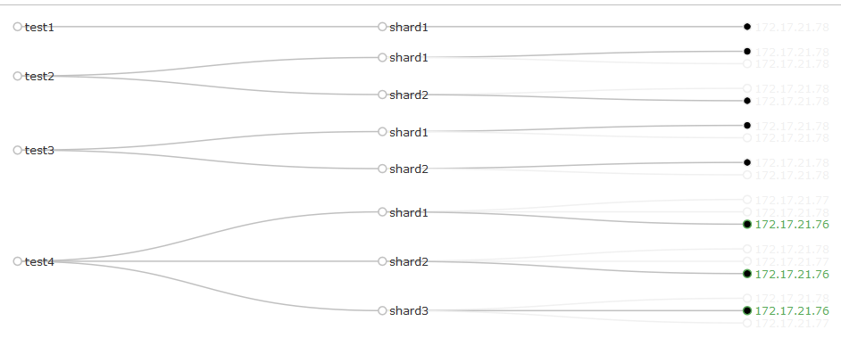

# 三探 Collection

到现在为止，SolrCloud 仅由一个 node 组成。而我准备了 3 台服务器。很显然，这一次将要在由 3 个 node 组成的 SolrCloud 上创建 Collection

## 启动其他 2 个 node

首先，将需要的 jar 包发送到 sc76，sc77，在 sc78 上执行如下命令

```bash
[root@sc78 ~]# scp /data/solr/dist/ik-analyzer-solr5-5.x.jar root@sc77:/data/solr/dist/.
[root@sc78 ~]# scp /data/solr/dist/mysql-connector-java-5.1.39.jar root@sc77:/data/solr/dist/.

[root@sc78 ~]# scp /data/solr/dist/ik-analyzer-solr5-5.x.jar root@sc76:/data/solr/dist/.
[root@sc78 ~]# scp /data/solr/dist/mysql-connector-java-5.1.39.jar root@sc76:/data/solr/dist/.
```


分别在 sc76，sc77 上以 cloud 模式启动 solr，执行如下命令

```bash
/data/solr/bin/solr start -cloud -z zk:2181/sc
```

如无意外，solr 将成功拉起，进入 solr 管理界面 Cloud - Tree 查看，当前 SolrCloud 已经由 3 个 node 组成，如下图



## 创建 collection

既然有 3 个 node，那么我这一次创建的 collection 就由 3 个 shard，每个 shard 各 3 个 replica 组成，还是在 sc78 上执行如下命令

```bash
[root@sc78 ~]# /data/solr/bin/solr create -c test4 -d tv -shards 3 -replicationFactor 3

Connecting to ZooKeeper at zk:2181/sc ...
Uploading /data/solr/server/solr/configsets/tv/conf for config test4 to ZooKeeper at zk:2181/sc

Creating new collection 'test4' using command:
http://localhost:8983/solr/admin/collections?action=CREATE&name=test4&numShards=3&replicationFactor=3&maxShardsPerNode=3&collection.configName=test4

{
  "responseHeader":{
    "status":0,
    "QTime":14086},
  "success":{
    "172.17.21.78:8983_solr":{
      "responseHeader":{
        "status":0,
        "QTime":4774},
      "core":"test4_shard3_replica1"},
    "172.17.21.77:8983_solr":{
      "responseHeader":{
        "status":0,
        "QTime":5367},
      "core":"test4_shard2_replica2"},
    "172.17.21.76:8983_solr":{
      "responseHeader":{
        "status":0,
        "QTime":5399},
      "core":"test4_shard3_replica3"}}}
```

创建成功，看图



可以看到，每个 shard 都有 3 个 replica，而这 3 个 replica 分别在不同的 node 上。这意味着，3 个节点即便挂掉任意的 2 个，collection 依然可用

## SolrCloud 高可用

SolrCloud 的一个特性就是高可用，验证一下，在 sc77，sc78 上分别停止 solr，执行

```bash
/data/solr/bin/solr stop
```

此时，只有 sc76 依然健在，那么只能从 sc76 来访问管理页面了，从浏览器进入 http://sc76:8983/solr/，进入 Cloud - Tree，如下图



可以看到，test1-3 的 replica 全部变灰，意味着这几个 collection 不可用。而 test4 依然坚挺，但是可用的 replica 仅有 172.17.21.76