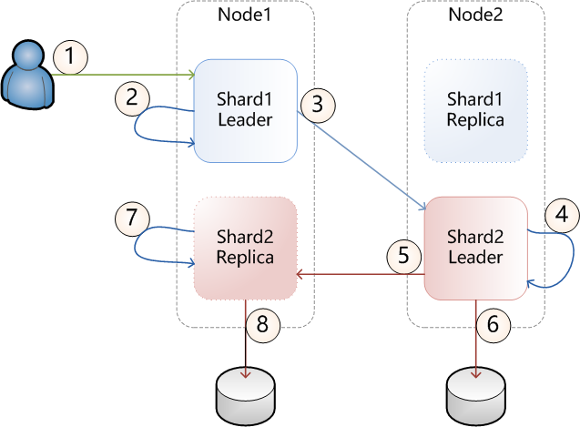

# Solr 更新处理

## 更新处理器

所有的更新处理器，都继承自 [UpdateRequestProcessor](http://lucene.apache.org/solr/6_0_0//solr-core/org/apache/solr/update/processor/UpdateRequestProcessor.html)。solr 在接收到更新请求时，会创建该类的实例，更新处理完成会销毁该实例，因此这个类不需要考虑线程安全。

## 更新处理器链

多个更新处理器组成一个处理器链，solr 对更新请求的处理是采用的职责链模式。Solr core 在加载时就会构造处理器链，可以配置多个处理器链并在提交更新请求时指定一个。

如果不配置的话，solr 会有一个默认的处理器链来处理更新请求。

链上的处理器是按顺序执行的，一个处理器执行完更新请求，可以把请求转发给下一个处理器，也可以提前结束处理，比如抛出异常或者不调用下一个处理器。

## 默认的处理器链

如果没有在 `solrconfig.xml` 里配置处理器链，solr 会使用一个默认的处理器链，该链由如下的处理器按顺序组成

1. LogUpdateProcessorFactory - 跟踪命令的处理并记下日志 
2. DistributedUpdateProcessorFactory - 负责将更新请求分发到正确的节点。该处理器仅在 SolrCloud 模式才会激活 
3. RunUpdateProcessorFactory - 使用 solr 内部的 api 来执行更新

## DistributedUpdateProcessor

```xml
<updateRequestProcessorChain name="dedupe">
  <processor class="solr.processor.SignatureUpdateProcessorFactory">
    <bool name="enabled">true</bool>
    <str name="signatureField">id</str>
    <bool name="overwriteDupes">false</bool>
    <str name="fields">name,features,cat</str>
    <str name="signatureClass">solr.processor.Lookup3Signature</str>
  </processor>
  <processor class="solr.LogUpdateProcessorFactory" />
  <processor class="solr.RunUpdateProcessorFactory" />
</updateRequestProcessorChain>
```

上面是一个自定义的处理器链的例子，这个例子没有指定 DistributedUpdateProcessor。由于这个处理器对于 solr 的重要性，solr 会自动将其插入到任何不包含它的处理器链，其顺序是恰好在 RunUpdateProcessorFactory 处理器之前

## 分布式更新

配置了如上的处理器链以后，Solr 如何执行更新呢？



流程说明

1. 客户端向 SolrCloud 发送一个更新请求，该请求被 shard1.Leader 接收到。(注意这完全是随机的)
2. shard1.Leader 顺序执行如下的处理器
  * SignatureUpdateProcessor
  * LogUpdateProcessor
  * DistributedUpdateProcessor：该处理器发现这个更新请求实际应该是由 shard2 负责处理，转发请求到 Shard2.Leader
3. shard1.Leader 将更新请求转发给 shard2.Leader
4. shard2.Leader 发现这个请求是从另一个 node 转发过来的，而不是从客户端发送过来，会直接执行 DistributedUpdateProcessor
  * DistributedUpdateProcessor 发现这个更新请求确实是由本 node 执行，把请求分发给 shard2 的其他 replica
  * 继续执行 RunUpdateProcessor
5. shard2.Leader 将更新请求分发给 shard2.Replica
6. shard2.Leader 执行 RunUpdateProcessor，这个处理器会实际更新索引数据
7. shard2.Replica 接收到更新请求，发现是从 Leader 分发过来的，直接执行 DistributedUpdateProcessor，只是做一些一致性检查
8. shar2.Replica 执行 RunUpdateProcessor 更新索引数据

## 预处理器和后处理器

DistributedUpdateProcessor 的特殊之处就在与，在它之前的处理器，只在转发节点(即上面例子的 shard1.Leader，是接收到更新请求的第一个节点)上执行一次，这些处理器称为预处理器；而在它之后的处理器，不在转发节点上执行，只会在 Leader 和 Replica 上执行，这些处理器称为后处理器

## 使用自定义处理器链

在请求参数里使用 `update.chain` 即可使用自定义的处理器链。如下所示

```bash
curl "http://localhost:8983/solr/gettingstarted/update/json?update.chain=dedupe&commit=true" -H 'Content-type: application/json' -d '
[
  {
    "name" : "The Lightning Thief",
    "features" : "This is just a test",
    "cat" : ["book","hardcover"]
  },
  {
    "name" : "The Lightning Thief",
    "features" : "This is just a test",
    "cat" : ["book","hardcover"]
  }
]'
```