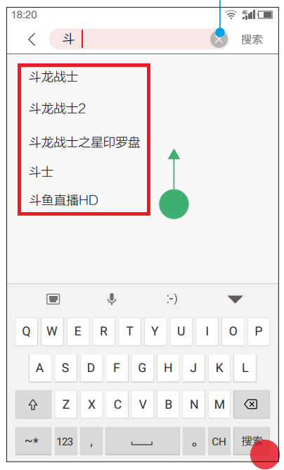

# 搜索建议

## 什么是搜索建议

如下图，在搜索框内输入`斗`，红框内展示的即为**搜索建议**



所谓搜索建议，就是根据用户已输入的关键字，提供几个几个备选的关键字。Solr 自带建议组件，只需简单配置即可。

## 如何配置

### 在 solrconfig.xml 添加建议组件

```xml
<searchComponent name="suggest" class="solr.SuggestComponent">
  <lst name="suggester">
  <str name="name">mySuggester</str>
  <str name="lookupImpl">FuzzyLookupFactory</str>
  <str name="dictionaryImpl">DocumentDictionaryFactory</str>
  <str name="field">name</str>
  <str name="weightField">heat</str>
  <str name="suggestAnalyzerFieldType">string</str>
  <str name="buildOnStartup">false</str>
  </lst>
</searchComponent>
```

参数说明

| 参数 | 说明 |
| -- | -- |
| searchComponent Name | 该建议组件的名称 |
| name | 建议器的名称，在 URL 参数和 SearchHandler 配置里引用该名称 |
| lookupImpl | 如何查找建议，solr 自带了几个可用的实现，默认为 JaspellLookupFactory |
| dictionaryImpl | 建议词典，solr 自带了几个词典的实现，默认的词典实现为 HighFrequencyDictionaryFactory |
| field | 索引里的一个字段，用来作为建议词条的基础 |
| weightField | 权重字段，用来对多个建议关键字进行排序 |
| buildOnStartup | true 表示在 Solr 启动时或 core 重载时创建词典。通常把这个设置设为 false，并手工创建建议，即在提交建议请求时使用 `suggest.build=true`|

### 在 solrconfig.xml 添加建议请求处理器

添加建议组件以后，必须在 `solrconfig.xml` 里添加请求处理器，示例如下

```xml
<requestHandler name="/suggest" class="solr.SearchHandler" startup="lazy">
  <lst name="defaults">
    <str name="suggest">true</str>
    <str name="suggest.count">10</str>
  </lst>
  <arr name="components">
    <str>suggest</str>
  </arr>
</requestHandler>
```

参数说明

| 参数 | 说明 |
| -- | -- |
| suggest=true | 该参数必须为 true |
| suggest.dictionary | 在建议组件里配置的建议器的名称。该参数是必须滴，可以在请求处理器里设置，也可以在查询时通过参数传递 |
| suggest.q | 查找建议时用的查询 |
| suggest.count | 指定 Solr 返回的建议数量 |
| suggest.build | true 表示构建建议索引。仅在初次请求时有用 |
| components.name| 这里填入上一步骤定义的建议组件的名称 |

### 如何获取建议

```bash
http://localhost:8983/solr/tv/suggest?suggest=true&suggest.build=true \
&suggest.dictionary=mySuggester&wt=json&suggest.q=xiyou
```

## 实战


