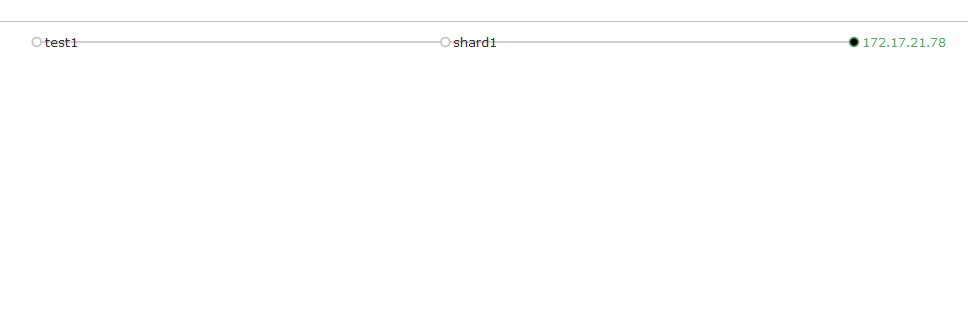

# 探索 Collection

很显然，我搭建 SolrCloud 的目地就是要在上面创建 collection。那么现在就来尝试一下吧

## 创建第一个 collection

如前所述，我已经在 sc78 上运行起了 SolrCloud。虽然这个 SolrCloud 仅由一个 node 组成，但其管理后台有 Cloud 菜单已充分证明 solr 的确运行在 cloud 模式下。现在就在这个 SolrCloud 上创建一个 collection 吧

使用命令行创建 collection，如下

```bash
[root@sc78 ~]# /data/solr/bin/solr create -c test1

Connecting to ZooKeeper at zk:2181/sc ...
Uploading /data/solr/server/solr/configsets/data_driven_schema_configs/conf for config test1 to ZooKeeper at zk:2181/sc

Creating new collection 'test1' using command:
http://localhost:8983/solr/admin/collections?action=CREATE&name=test1&numShards=1&replicationFactor=1&maxShardsPerNode=1&collection.configName=test1

{
  "responseHeader":{
    "status":0,
    "QTime":7683},
  "success":{"172.17.21.78:8983_solr":{
      "responseHeader":{
        "status":0,
        "QTime":5247},
      "core":"test1_shard1_replica1"}}}
```

说明

命令很简单，创建一个名称为 test1 的 collection。那么 solr 是如何执行这个命令的呢？根据 solr 的输出信息，我们看到 solr 实际执行了 2 个步骤

1. 将 /data/solr/server/solr/configsets/data_driven_schema_configs/conf 这个目录的内容上传到 zk 的 /sc 节点下
2. 新建 test1 这个 collection，实际是调用了 http 接口，其 url 是 http://localhost:8983/solr/admin/collections?action=CREATE&name=test1&numShards=1&replicationFactor=1&maxShardsPerNode=1&collection.configName=test1，请求的参数有 name， numShards， replicationFactor， maxShardsPerNode， configName，所谓见名知意，这几个参数的含义应该也不难理解

打开管理界面，进入 Cloud - Graph 页面，如下图



collection test1，由一个 shard，即 shard1 组成。shard1 有一个 replica，该 replica 在 172.17.21.78 上的 solr 实例中。

毫无疑问，这是一个最简单的 collection，实际上和单机模式下创建的 core 也没什么区别