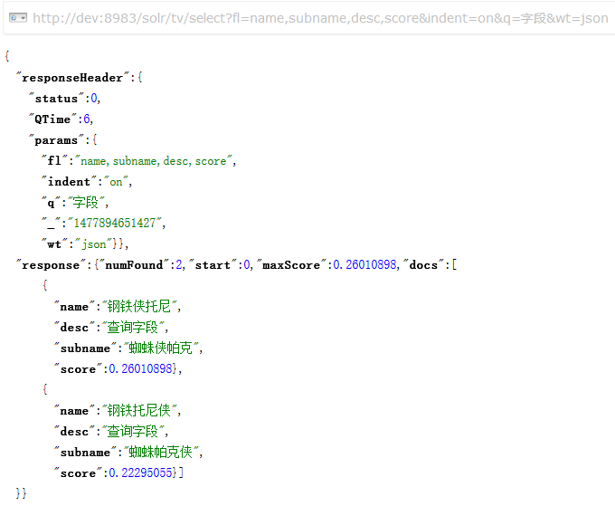
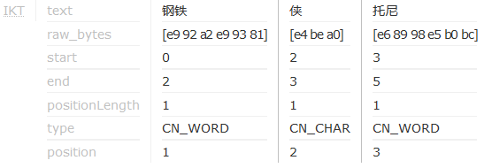
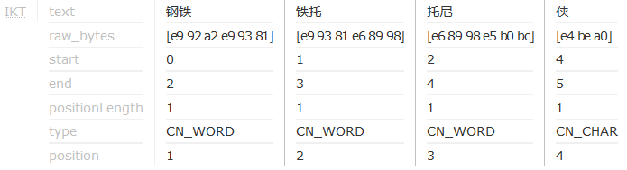
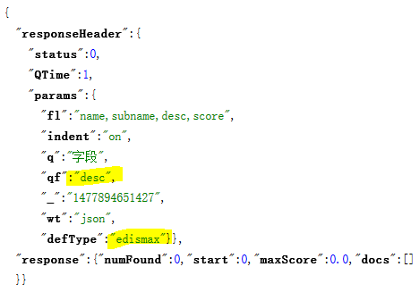
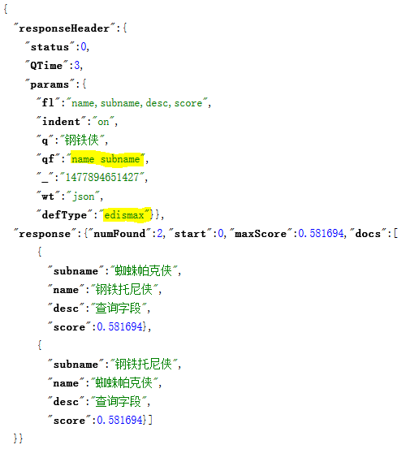
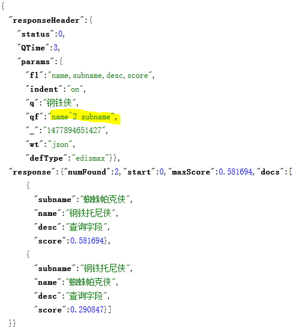

# 提高匹配度之查询字段

在查询时，如果没有在查询条件里指定查询字段，则查询会在默认字段上执行。默认查询字段有 2 种指定方式

1. `df` 参数
2. solrconfig.xml

例如，tv 的 solrconfig.xml 里是这样配置的

```xml
  <initParams path="/update/**,/query,/select,/tvrh,/elevate,/spell,/browse">
    <lst name="defaults">
      <str name="df">tvinfo</str>
    </lst>
  </initParams>
```

DisMax/eDisMax 有个 `qf` 参数，如果未指定该参数，查询是在默认查询字段上执行，否则将在该参数指定的字段上执行

## qf

指定查询的字段及其加权因子，格式为

```
查询字段1^加权因子1 查询字段2^加权因子2 ...
```

若加权因子忽略，表示取默认值 1

示例如下

```
qf=name^2.3 subname desc^0.4
```

## qf 字段必须索引

有如下 2 个文档

```python
albums = (
    Album(name='钢铁托尼侠', subname='蜘蛛帕克侠', desc='查询字段', ),
    Album('钢铁侠托尼', '蜘蛛侠帕克', '查询字段', )
)
```

其中，`name` 和 `subname` 字段有索引，`desc` 字段无索引，默认查询字段 `tvinfo` 来源于 `name` 和 `desc`，查询参数 `q=字段`

### 使用默认字段

应该可以搜索到结果，如下



奇怪的是 2 个结果的得分不同，为什么呢？看一下 `钢铁侠托尼` 和 `钢铁托尼侠` 的分词结果吧

```
钢铁侠托尼
```



```
钢铁托尼侠
```



由于 `钢铁托尼侠` 比 `钢铁侠托尼` 分出了更多的词条，导致其命中单个词条的分数较低

> **注意**
> 
> `蜘蛛帕克侠` 和 `蜘蛛侠帕克` 也存在类似情况，但 `tvinfo` 并未复制 `subname` 字段

### 使用 qf=desc

由于 `desc` 字段未建索引，应该是查询不到结果，如下



## 通过设置字段权重影响排序

为了观察字段权重对搜索结果排序的影响，使用如下 2 个文档

```python
albums = (
    Album(name='钢铁托尼侠', subname='蜘蛛帕克侠', desc='查询字段', ),
    Album('蜘蛛帕克侠', '钢铁托尼侠', '查询字段', )
)
```

2 个文档的 name 和 subname 分别相同，这样相同的搜索参数作用在不同的字段上，理应得到相同的分数，验证一下



那么，如果提升 `name` 字段的加权因子呢？



2 个文档的得分出现了明显的差异，其中 `name=钢铁侠托尼` 的文档得分不变，而 `name=蜘蛛侠帕克` 的文档得分下降了。虽然的确通过加权因子影响了搜索结果的排序，但这个分数有点费解，恐怕只有看 solr 打分的源码才能彻底弄明白了

## 结论

1. DisMax/eDisMax 的 qf 参数可以指定查询字段及其权重因子，如果未指定则在默认字段上查询
2. qf 指定的字段须建索引，否则该字段无效
3. 加权因子对得分的影响有点奇怪，没看源码无法解释