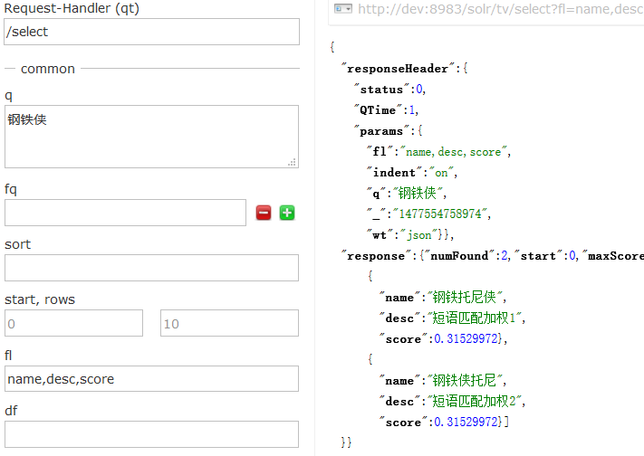
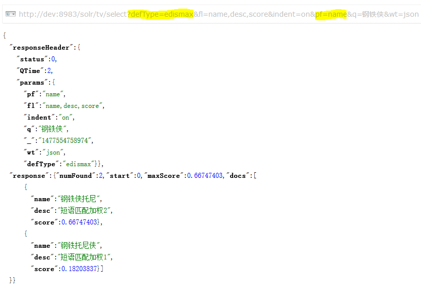
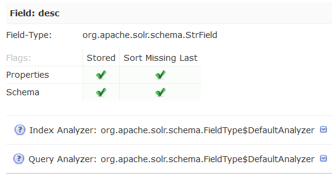
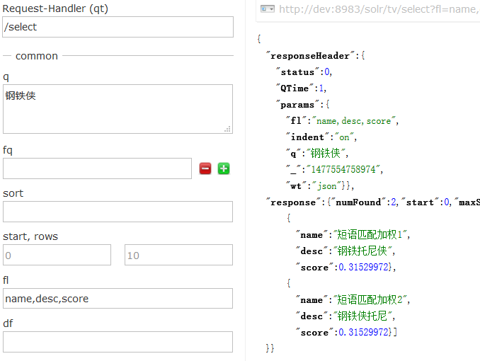
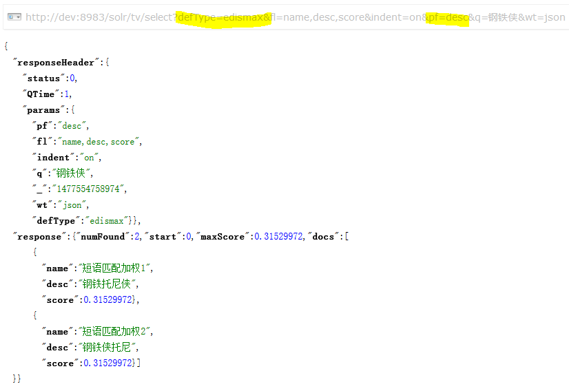

# 提高匹配度之短语匹配

DisMax/eDisMax 有个 pf 参数，如下

## pf

短语匹配加权的字段：把 `q` 参数的值视为一个短语，`pf` 参数所指定的字段如果能匹配到该短语，会增加其匹配度权重。

> 首先要明白什么是短语：```hello world``` 分词以后得到 2 个词条：```hello``` 和 ```world```，但是如果我想要查询的是整个 ```hello world``` 呢？可以用引号 ```"hello world"``` 来表示这是个短语，就不会被分词了

> 当然，这是针对英文的分词而言，由于中文文档里很少用空格来分隔单个字，所以中文的词天生就是短语：```钢铁侠```即使不用引号也是一个短语

pf 参数格式如下

```
字段1^加权因子1 字段2^加权因子2 ...
```

示例

```
pf=name^2 desc^0.8 actor
```

如果不指定加权因子，默认为 1

什么叫匹配到短语呢？例如，有如下几个文档

```
1. hello world solr
2. hello solr world
3. solr world hello
4. world solr hello
```

查询条件为 ```q=hello world```

* 如果短语匹配加权，文档 1 的匹配度会大于其他文档，因为文档 1 做到了短语匹配；
* 如果短语匹配不加权，那么所有文档的匹配度是一样滴

## 例子

我们来看个例子，将如下 2 个文档添加到 tv 里

```python
albums = (
    Album('钢铁托尼侠', '短语匹配加权1', ),
    Album('钢铁侠托尼', '短语匹配加权2', )
)
```

然后查一下



可以看到在标准查询模式下 2 个文档的分数是一样一样滴，但以人类的逻辑来说，```钢铁侠托尼```应该比```钢铁托尼侠```更要匹配才对，怎么让 solr 做到呢？

用 eDisMax 的短语匹配加权来试一下吧



注意图上荧光笔涂抹的部分，搜索关键字不变，使用 eDisMax 并设定 name 字段为短语匹配加权字段后，可以看到 2 个文档的得分明显拉开了差距

## pf 字段必须索引

那么，如果该字段没有建索引能生效吗？我们来试一下，将文档的 name 和 desc 字段值交换一下

```python
albums = (
    Album('短语匹配加权1', '钢铁托尼侠', ),
    Album('短语匹配加权2', '钢铁侠托尼', )
)
```

我们先确认一下，desc 字段是没有索引滴



先用标准查询解析器搜索，结果如下图，2 个文档的分数还是一样滴



然后，在用短语匹配字段 pf=desc 的试下，结果如下



可以看到该参数对于非索引字段是无效滴

## 结论

短语匹配比词条全匹配的匹配度更高，并且还能为不同字段设置不同的匹配度权重。善用 eDisMax 的 pf 参数是可以提高匹配度滴

## TODO LIST

如果没有做到短语匹配，字段权重还有效吗？