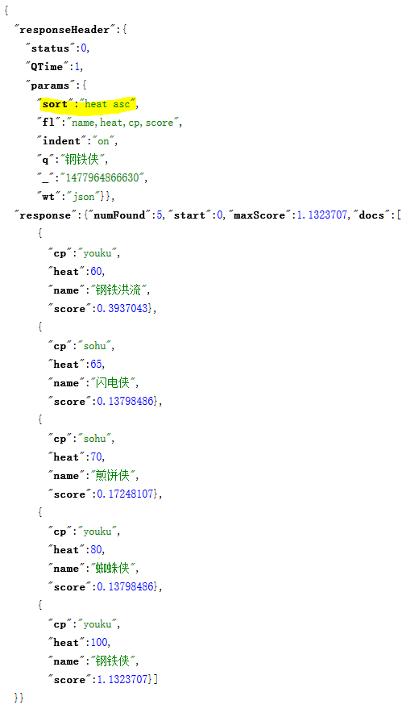
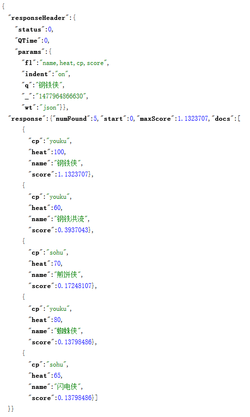
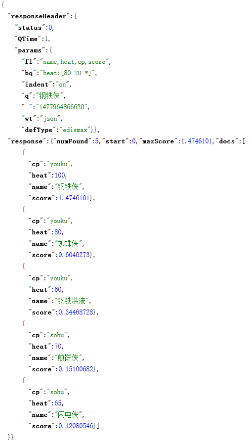
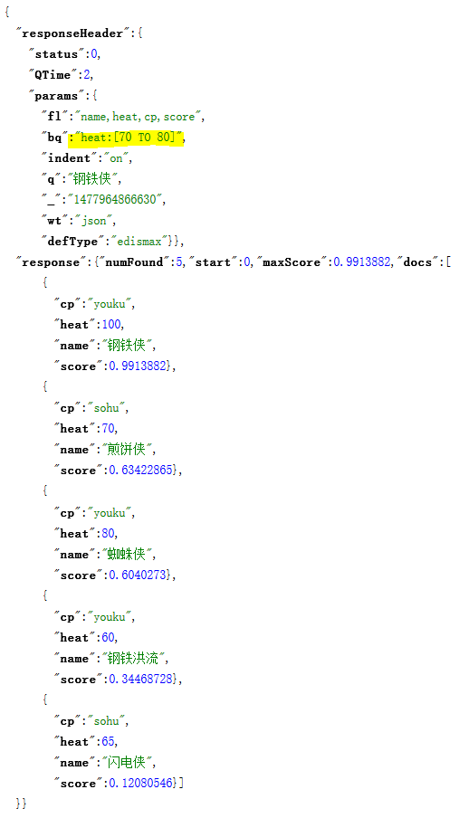
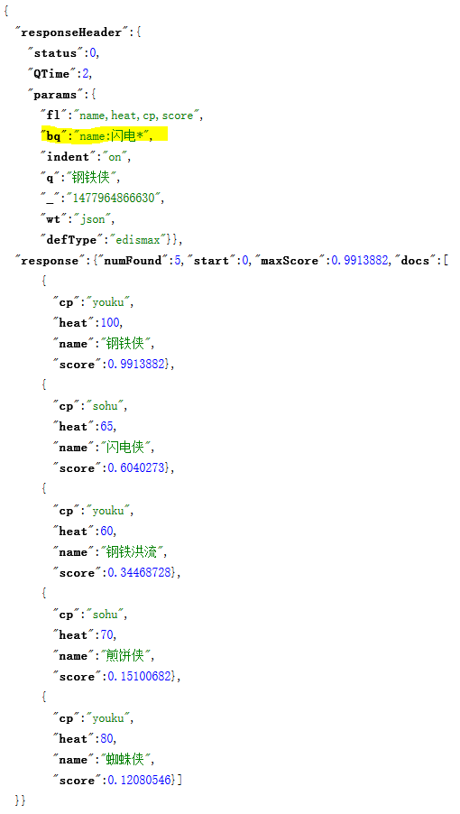

# 提高匹配度之加权查询

如果想要对查询结果按某个字段排序，可以用 `sort` 参数，但 `sort` 参数会忽视文档匹配度，这样可能会导致匹配度较低的文档位于搜索结果前列。

例如，有如下的文档

```python
albums = (
    Album(name='钢铁侠', heat=100, cp='youku'),
    Album(name='煎饼侠', heat=70, cp='sohu'),
    Album(name='蜘蛛侠', heat=80, cp='youku'),
    Album(name='钢铁洪流', heat=60, cp='youku'),
    Album(name='闪电侠', heat=65, cp='sohu'),
)
```

按 `heat` 字段升序排列，会导致评分最高的文档排在最后，如图



可见，简单的按某个字段升序或降序排列并不足以提高匹配度。

考虑这样一个需求：查询的结果，日期越接近当前时间的文档，其匹配度越高，例如新闻查询，哪怕匹配度相对低一些，但考虑到新闻的时效性，应该把最近的新闻排在前面。

DixMax/eDisMax 提供了 `bq` 参数，也许可以满足这样的需求

## bq

`bq` 参数提供了一个子查询，满足该子查询的文档其匹配度会提升。如果有多个条件都要加权，可以传递多个 `bq` 参数，其格式如下

```
bq=heat:[90 TO 100]&bq=name:煎饼&bq=....
```

先看下不支持 `bq` 参数的标准查询解析器的结果



对 `heat>=80` 的文档加权



再看下对 `70<=heat<=80` 的文档加权



可以看到 `钢铁侠` 虽然不满足加权条件，依然高居结第一。再换个条件试一下，这次试试能否将原本排在榜尾的 `闪电侠` 往前排



看上去还不错，`闪电侠` 虽然提前了，但依然没有影响 `钢铁侠` 的榜首地位。

## 结论

1. `bq` 参数并不影响查询的结果，影响的是结果的排序
2. `bq` 的加权是有限的，并不足以影响匹配度相差较大的文档之间的相对排序