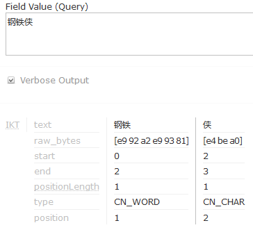
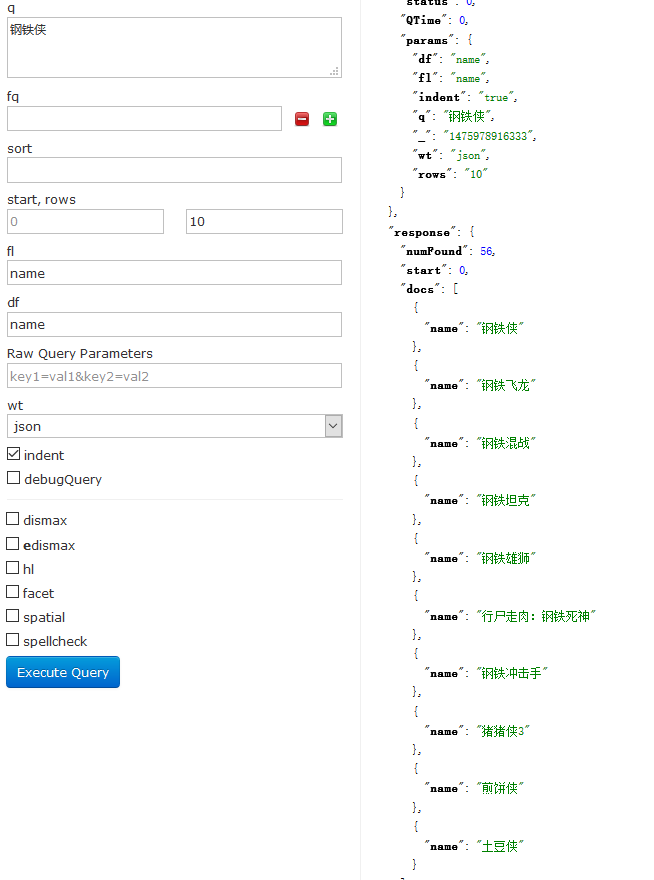
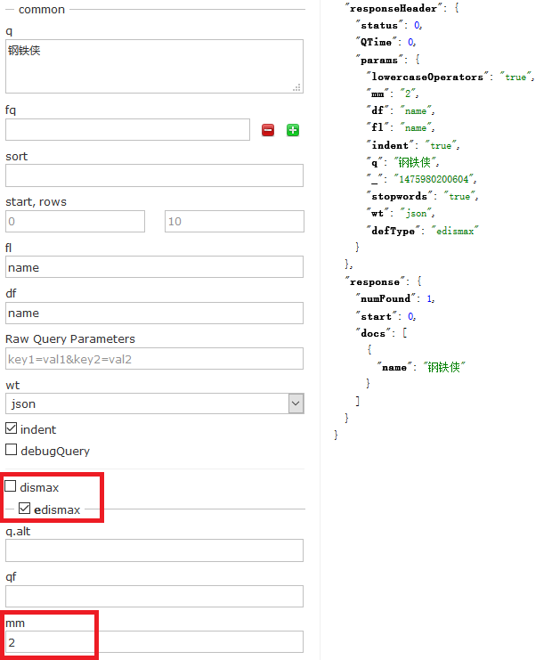
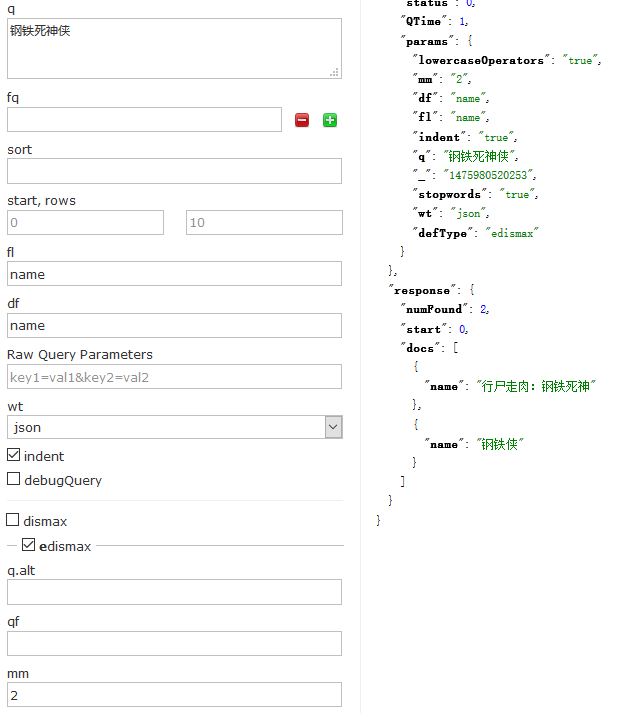

# 提高匹配度之MM大法

搜索引擎对查询请求进行分词后查询是个创举，提高了搜索结果的适用性，用户也无需学习查询语法

但也有不好的一面：可能返回一些不那么匹配的结果。

来看一个例子：以`钢铁侠` 来关键字来做搜索

首先，搜索引擎会怎样对查询条件进行分词呢

不同的分词算法有不同的结果，这里使用的是 IK Analyzer，其内置的词典里没有 `钢铁侠` 这个词，因此分词结果是  `钢铁` 和 `侠`

可以想象，包含 `钢铁` 和 `侠` 的文档都会被查询出来，验证如下

搜索 `钢铁侠`，结果返回的结果居然有 `煎饼侠`，`土豆侠`......这也太扯蛋了，怎么提高一下这个匹配度呢？

首先要介绍一下 solr 的查询参数 `defType`

* defType: 用于指定查询解析器，默认为标准查询解析器 lucene，其他取值还有 DisMax 和 eDisMax

DixMax(Maximum Disjunction) 查询解析器被设计来处理简单短语和多个不同权重的字段，solr 号称该解析器更像 google 而不是 lucene，而 eDisMax 则是扩展的(Extended) DisMax，是 DisMax 的一个优化版本

eDisMax 非常强大，参数很多，今天就介绍一些使用 mm 参数来提高搜索结果匹配度的方法

## mm 参数

Minimum "Should" Match，至少匹配，指定查询至少要匹配几个条件

Lucene/Solr 在处理查询时，有 3 类子句：强制的，禁止的，可选的。默认情况下，`q` 参数里的所有词条或短语都被作为可选的，除非前面有 + 或者 -。在处理可选的子句时，`mm` 参数表示最少有多少可选的子句要被匹配，eDisMax 查询解析器对于如何指定 `mm` 提供了极大的灵活性

| 语法 | 示例 | 说明 |
| :--- | :--- | :---|
|正整数| 3 |最少有几个子句需要匹配，不论总共有多少子句|
|负整数| -2 |从全部子句里减去多少个子句|
|百分比|75%|全部子句总数的百分比，向下取整|
|负百分比|-25%|全部子句里可以不用匹配的子句所占的百分比，向下取整|
|表达式：正整数后跟>或<和另一个值|3<90%|如果全部子句数量等于或小于该正整数，那么就都是强制的；但是如果是大于这个正整数，那么就只需要满足百分比|
|多项表达式，包含>或<|2<-25% 9<-3|多个表达式，任一个要生效，必须是其数字比前一个的数字更大。左边的例子里，如果有 1~2 个子句，则都是强制的；如果有 3~9 个子句，则 -25% 是强制的；如果超过 9 个子句，则 -3 是必须的|

默认的 mm=100%

## 使用 mm 参数

使用 eDisMax 查询解析器，并指定 `mm=2`，可以看到诸如`煎饼侠`，`土豆侠`这样不靠谱的结果已经被过滤掉了

为了加深对 `mm` 参数的理解，接下来把查询条件修改为 `钢铁死神侠`，那么查询条件经过分词以后就是`钢铁`， `死神`， `侠`，包含这 3 个词条中任意 2 个的文档就符合了 `mm=2`，验证如下

## 结论

启用 eDisMax 查询解析器并通过设定合理的 `mm` 值，可以在不修改词典的前提下提高匹配度