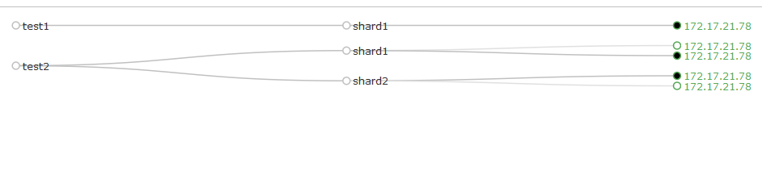
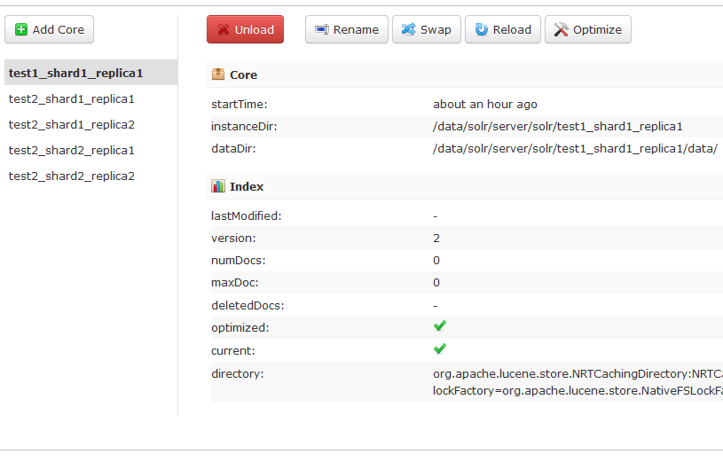
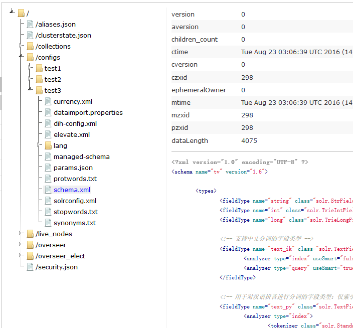

# 再探 Collection

如果一个 collection 只有一个 shard，而这个 shard 又只有一个 replica，那和单机模式有神马区别？捣腾 cloud 模式岂不是闲的蛋疼？所以这一次我来创建一个多 shard 多 replica 的 collection

## 使用默认配置

```bash
[root@sc78 ~]# /data/solr/bin/solr create -c test2 -shards 2 -replicationFactor 2

Connecting to ZooKeeper at zk:2181/sc ...
Uploading /data/solr/server/solr/configsets/data_driven_schema_configs/conf for config test2 to ZooKeeper at zk:2181/sc

Creating new collection 'test2' using command:
http://localhost:8983/solr/admin/collections?action=CREATE&name=test2&numShards=2&replicationFactor=2&maxShardsPerNode=4&collection.configName=test2

{
  "responseHeader":{
    "status":0,
    "QTime":12983},
  "success":{"172.17.21.78:8983_solr":{
      "responseHeader":{
        "status":0,
        "QTime":3770},
      "core":"test2_shard1_replica2"}}}
```

这次创建的 collection 为 test2，2 个 shard(`numShards=2`)，每个 shard 有 2 个 replica(`replicationFactor=2`)，结果看图


很显然，配置依然在 zk 上；那么 core 呢，应该是 4 个吧？



查看目录

```bash
[root@sc78 ~]# ll /data/solr/server/solr/
total 36
drwxr-xr-x 5 root root 4096 Jun 21 11:45 configsets
-rw-r--r-- 1 root root 3114 Jun 21 11:45 README.txt
-rw-r--r-- 1 root root 2170 Jun 21 11:45 solr.xml
drwxr-xr-x 3 root root 4096 Aug 23 08:57 test1_shard1_replica1
drwxr-xr-x 3 root root 4096 Aug 23 09:58 test2_shard1_replica1
drwxr-xr-x 3 root root 4096 Aug 23 09:58 test2_shard1_replica2
drwxr-xr-x 3 root root 4096 Aug 23 09:58 test2_shard2_replica1
drwxr-xr-x 3 root root 4096 Aug 23 09:58 test2_shard2_replica2
-rw-r--r-- 1 root root  518 Jun 21 11:45 zoo.cfg
```

## 自定义配置

create 命令可以使用 `-d` 选项来指定配置目录，如果不指定的话，会使用 `data_driven_schema_configs` 作为默认配置。test1 和 test2 都是用的默认配置，那么接下来就试下自定义配置吧

### 准备自定义配置

直接把之前在单机模式下创建的名为 tv 的 core 的配置文件复制过来吧，由于这些个配置文件在其他的服务器上，所以打包后传送到 sc78 上，解压缩后移动到 `/data/solr/server/solr/configsets/tv/conf`

```bash
[root@sc78 ~]# mkdir /data/solr/server/solr/configsets/tv
[root@sc78 ~]# mv conf /data/solr/server/solr/configsets/tv/.
[root@sc78 ~]# ls /data/solr/server/solr/configsets/tv
conf
[root@sc78 ~]# ll /data/solr/server/solr/configsets/tv/conf
total 160
-rw-r--r-- 1 root root  4041 Jun 21 11:45 currency.xml
-rw-r--r-- 1 root root   206 Aug 16 14:18 dataimport.properties
-rw-r--r-- 1 root root  2552 Jul 11 14:37 dih-config.xml
-rw-r--r-- 1 root root  1386 Jun 21 11:45 elevate.xml
drwxr-xr-x 2 root root  4096 Jun 21 11:45 lang
-rw-r--r-- 1 root root 54490 Jun 20 20:52 managed-schema
-rw-r--r-- 1 root root   329 Jun 21 11:45 params.json
-rw-r--r-- 1 root root   894 Jun 21 11:45 protwords.txt
-rw-r--r-- 1 root root  4075 Aug 16 14:17 schema.xml
-rw-r--r-- 1 root root 63457 Aug 16 14:27 solrconfig.xml
-rw-r--r-- 1 root root   795 Jun 21 11:45 stopwords.txt
-rw-r--r-- 1 root root  1148 Jun 21 11:45 synonyms.txt
```
### 以自定义的配置创建 collection

```bash
[root@sc78 ~]# /data/solr/bin/solr create -c test3 -d tv -shards 2 -replicationFactor 2

Connecting to ZooKeeper at zk:2181/sc ...
Uploading /data/solr/server/solr/configsets/tv/conf for config test3 to ZooKeeper at zk:2181/sc

Creating new collection 'test3' using command:
http://localhost:8983/solr/admin/collections?action=CREATE&name=test3&numShards=2&replicationFactor=2&maxShardsPerNode=4&collection.configName=test3


ERROR: Failed to create collection 'test3' due to: {172.17.21.78:8983_solr=org.apache.solr.client.solrj.impl.HttpSolrClient$RemoteSolrException:Error from server at http://172.17.21.78:8983/solr: Error CREATEing SolrCore 'test3_shard1_replica2': Unable to create core [test3_shard1_replica2] Caused by: org.wltea.analyzer.lucene.IKAnalyzer}
```

从命令的输出可以看到，上传配置目录到 zk 成功了，但是创建 collection 失败了，看异常提示与中文分词器 IK 相关。应该是因为在类路径里找不到 IK 的 jar 包，那么就把需要的 jar 包都复制到 `/data/solr/dist` 目录下

```bash
[root@sc78 ~]# cp mysql-connector-java-5.1.39.jar /data/solr/dist/.
[root@sc78 ~]# cp ik-analyzer-solr5-5.x.jar /data/solr/dist/.
[root@sc78 ~]# ls /data/solr/dist
ik-analyzer-solr5-5.x.jar        solr-dataimporthandler-5.5.2.jar         solr-solrj-5.5.2.jar
mysql-connector-java-5.1.39.jar  solr-dataimporthandler-extras-5.5.2.jar  solr-test-framework-5.5.2.jar
solr-analysis-extras-5.5.2.jar   solrj-lib                                solr-uima-5.5.2.jar
solr-analytics-5.5.2.jar         solr-langid-5.5.2.jar                    solr-velocity-5.5.2.jar
solr-cell-5.5.2.jar              solr-map-reduce-5.5.2.jar                test-framework
solr-clustering-5.5.2.jar        solr-morphlines-cell-5.5.2.jar
solr-core-5.5.2.jar              solr-morphlines-core-5.5.2.jar
```

这个好像需要重启一下 solr

```bash
[root@sc78 ~]# /data/solr/bin/solr stop
Sending stop command to Solr running on port 8983 ... waiting 5 seconds to allow Jetty process 2240 to stop gracefully.

[root@sc78 ~]# /data/solr/bin/solr start -cloud -z zk:2181/sc
Waiting up to 30 seconds to see Solr running on port 8983 [/]
Started Solr server on port 8983 (pid=7142). Happy searching!
```

然后创建 collection

```bash
[root@sc78 ~]# /data/solr/bin/solr create -c test3 -d tv -shards 2 -replicationFactor 2

Connecting to ZooKeeper at zk:2181/sc ...
Re-using existing configuration directory test3

Creating new collection 'test3' using command:
http://localhost:8983/solr/admin/collections?action=CREATE&name=test3&numShards=2&replicationFactor=2&maxShardsPerNode=4&collection.configName=test3

{
  "responseHeader":{
    "status":0,
    "QTime":11922},
  "success":{"172.17.21.78:8983_solr":{
      "responseHeader":{
        "status":0,
        "QTime":2662},
      "core":"test3_shard2_replica1"}}}
```

这一次创建成功了，见图



可以看到 test3 使用的的确是自定义的配置


